<!-- Assets in assets/ are generated by scripts/build_assets.py (light + dark). -->

<a href="https://portfolio-webapp-roan.vercel.app">
  <picture>
    <source media="(prefers-color-scheme: dark)" srcset="assets/banner-dark.svg">
    
  </picture>
</a>

  
  
  
  
  
  
  

I’m **Naresh**. I work **below the framework layer** of AI clusters: kernel networking, RDMA/RoCE, DPDK, SR-IOV, KVM and NCCL, about nine years of it. When a 512-GPU job stalls, the cause is usually one bad link, NIC or GPU, while every rank reports the same timeout. I build the infrastructure that finds that one component and gets training back fast, and that moves bytes between GPUs without wasting the hardware.

Everything here is **built in public**. A number only appears once it’s measured and linked to its run.

## 🎯 Two problems I work on

<table>
<tr>
<td width="50%" valign="top">

### 🔵 Reliability at scale
**[goodput](https://github.com/nareshns2004/fault-tolerant-training-orchestrator)**: fault attribution & recovery for multi-node training

**Problem.** One bad GPU, NIC, cable or switch port stalls a collective, and *every* rank times out the same way. Stock tooling detects in minutes, attributes nothing, and restarts the whole job.

**Approach.** Fault injection with a ground-truth ledger, NCCL flight-recorder signatures, DCGM and NIC telemetry joined on the topology to name the **culprit rank and component**, then the smallest safe recovery: in-process communicator re-init, single-node replacement, peer in-memory checkpoints.

**Status.** `M1 of 6` · design, interfaces and harness public · no results yet

</td>
<td width="50%" valign="top">

### 🟠 Efficiency at scale
**[kvwire](https://github.com/nareshns2004/disaggregated-inference-engine)**: RDMA KV-cache transport for disaggregated inference

**Problem.** Prefill is compute-bound and decode is memory-bound. Colocated, they interfere: prefills spike TPOT, decodes spike TTFT.

**Approach.** Split them onto separate GPU pools, and make the part in between fast and safe: a GPUDirect RDMA transport, a Triton KV re-layout kernel (kept only if the data justifies it), and a coordinator that stays correct when the network fails mid-transfer. Plugs into vLLM through its KV-connector interface.

**Status.** `M1` · baselines and hardware ceilings first

</td>
</tr>
</table>

## ▶️ Interactive notes: break things in your browser

Each one is a working simulator or calculator, with its model and assumptions stated. No hand-waved benchmarks.

| | Post | What you can do |
|---|---|---|
| 💥 | [**One dead link, 512 idle GPUs**](https://portfolio-webapp-roan.vercel.app/posts/ring-allreduce-failure.html) | Cut a link in a live ring all-reduce and watch every rank time out the same way |
| 🔎 | [**Triaging an NCCL timeout**](https://portfolio-webapp-roan.vercel.app/posts/nccl-timeout-triage.html) | Four incident drills: find the culprit from flight-recorder, Xid and NIC evidence |
| 🧊 | [**PFC: the lossless network that can freeze itself**](https://portfolio-webapp-roan.vercel.app/posts/pfc-deadlock.html) | Push a toy RoCE fabric into deadlock, then turn on ECN |
| 🛤️ | [**Where NCCL traffic actually goes**](https://portfolio-webapp-roan.vercel.app/posts/rail-topology.html) | Rail-optimized vs fat-tree for DP, TP and MoE all-to-all, with and without PXN |
| 📦 | [**The KV-cache bill**](https://portfolio-webapp-roan.vercel.app/posts/kv-cache-transfer.html) | Size the prefill→decode handoff for real model configs and link speeds |
| 💾 | [**How often should a 16K-GPU job checkpoint?**](https://portfolio-webapp-roan.vercel.app/posts/checkpoint-interval.html) | Young/Daly with sliders: which lever buys the most goodput |
| 🧵 | [**The packet path**](https://portfolio-webapp-roan.vercel.app/posts/packet-path.html) | Step one packet through the kernel stack, XDP, DPDK and RDMA |

## 🧱 Where I work in the stack

<picture>
  <source media="(prefers-color-scheme: dark)" srcset="assets/stack-dark.svg">
  
</picture>

<b>Skill → evidence map</b> (no self-ratings; every row links to the work)

 

| Area | Evidence | Stage |
|---|---|---|
| Collectives & NCCL | [goodput](https://github.com/nareshns2004/fault-tolerant-training-orchestrator) · [distributed-training-framework-nccl](https://github.com/nareshns2004/distributed-training-framework-nccl) · [ring all-reduce post](https://portfolio-webapp-roan.vercel.app/posts/ring-allreduce-failure.html) | design + harness |
| RDMA / RoCE / PFC | [nicprof](https://github.com/nareshns2004/ai-nic-performance-profiler) · [kvwire](https://github.com/nareshns2004/disaggregated-inference-engine) · [PFC post](https://portfolio-webapp-roan.vercel.app/posts/pfc-deadlock.html) | runnable |
| Linux kernel performance | [kptk](https://github.com/nareshns2004/kernel-performance-toolkit) | runnable |
| Inference serving | [kvwire](https://github.com/nareshns2004/disaggregated-inference-engine) · [high-performance-llm-inference-engine](https://github.com/nareshns2004/high-performance-llm-inference-engine) · [KV-cache post](https://portfolio-webapp-roan.vercel.app/posts/kv-cache-transfer.html) | early |
| GPU kernels (CUDA / Triton) | [custom-cuda-fused-attention-triton](https://github.com/nareshns2004/custom-cuda-fused-attention-triton) | early |
| eBPF / XDP / DPDK | [kernel-level-ai-traffic-shaper](https://github.com/nareshns2004/kernel-level-ai-traffic-shaper) · [packet path post](https://portfolio-webapp-roan.vercel.app/posts/packet-path.html) · [DPDK essay](https://nareshns2004.substack.com/p/intels-dpdk-the-userspace-data-plane) | early / write-up |
| Virtualization (SR-IOV / KVM) | [virtualization essay](https://nareshns2004.substack.com/p/virtualization-the-foundation-of) | write-up |
| ML for infra ops | [6 RCA & failure-prediction models](https://huggingface.co/nareshns2004) (NCCL, GPU, network, Linux, Kubernetes logs) | published |

## 🛠️ Runnable today

- **[nicprof](https://github.com/nareshns2004/ai-nic-performance-profiler)**: which NIC counter explains which millisecond of training step time. Aligns RDMA/ethtool/SR-IOV counters to each rank’s steps and traces PFC pause back to its origin, so a *victim* port isn’t blamed. `nicprof demo` · 69 tests
- **[kptk](https://github.com/nareshns2004/kernel-performance-toolkit)**: explains *why* a Linux workload is slow from kernel evidence: run-queue delay, NUMA locality, THP fallback, and `perf_event_open(2)` called directly. Standard library only · 43 tests

Also worked with: Java · Kafka · Hadoop · Redis · GraphQL · TensorFlow · Keras · OpenCV · AWS · Terraform · Ansible · Jenkins · Elasticsearch · OpenStack

---

  <b>Open to GPU cluster networking, distributed-training infrastructure and inference-platform roles</b> 
  USA · Canada · Europe · <a href="mailto:nareshns2004@gmail.com">nareshns2004@gmail.com</a> · <a href="https://portfolio-webapp-roan.vercel.app">portfolio</a>

